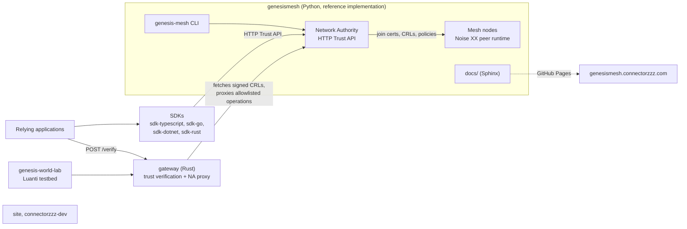

# How the GenesisMeshLabs projects fit together

Genesis Mesh is a protocol for sovereign communities to establish, delegate, recognize,
and revoke trust: cryptographic identity, signed certificates, revocation lists (CRLs),
and policy, without a central authority. This page maps the repositories and how they
depend on each other. For the protocol itself, see the
[genesismesh concepts docs](https://github.com/GenesisMeshLabs/genesismesh/tree/main/docs/concepts).

## The big picture

## Repositories

`site`, `genesis-quantum-lab`, and `genesis-world-lab` are in the
`extras` profile: not part of everyday development, so `bootstrap.py --all` skips them.

| Repository | Language | Role |
| --- | --- | --- |
| [genesismesh](https://github.com/GenesisMeshLabs/genesismesh) | Python | **Protocol authority.** Network Authority service, mesh node runtime, `genesis-mesh` CLI, protocol RFCs, conformance vectors, and the documentation site. Published to PyPI as `genesis-mesh`. |
| [gateway](https://github.com/GenesisMeshLabs/gateway) | Rust | Trust-verification gateway and API console. Verifies join certificates against pinned authority keys and fresh signed CRLs, and exposes an allowlisted proxy of Network Authority operations. **Not a second Network Authority**: it consumes trust material but never issues it. |
| [sdk-typescript](https://github.com/GenesisMeshLabs/sdk-typescript), [sdk-go](https://github.com/GenesisMeshLabs/sdk-go), [sdk-dotnet](https://github.com/GenesisMeshLabs/sdk-dotnet), [sdk-rust](https://github.com/GenesisMeshLabs/sdk-rust) | TS, Go, C#, Rust | Thin clients for the Network Authority HTTP Trust API. No runtime dependencies beyond the platform, Ed25519-signed admin requests, and typed errors. |
| [genesis-world-lab](https://github.com/GenesisMeshLabs/genesis-world-lab) | Go, Lua | Playable Luanti (Mineclonia) testbed for identity, delegation, and revocation. A Go bridge verifies evidence from two authorities; a mod enforces permission leases. Windows only. |
| [genesis-quantum-lab](https://github.com/GenesisMeshLabs/genesis-quantum-lab) | Docs, HCL | Research plan for the post-quantum phase of the protocol. |
| [site](https://github.com/GenesisMeshLabs/site) | Next.js | Public website. |
| [connectorzzz-dev](https://github.com/GenesisMeshLabs/connectorzzz-dev) | Next.js | Developer and product hub (SDKs, articles, videos). |
| [genesismesh-content](https://github.com/GenesisMeshLabs/genesismesh-content) | Python | Articles, campaigns, and media generation tooling. |
| [sandbox](https://github.com/GenesisMeshLabs/sandbox) | Python | Private experiments. |
| [.github](https://github.com/GenesisMeshLabs/.github) | | Organization profile and community defaults. |
| [devtools](https://github.com/GenesisMeshLabs/devtools) | Python | This repository: workspace setup. |

## Rules that span repositories

- **genesismesh is the source of truth.** Canonical JSON, signature formats, certificate
  and CRL structure, and API behavior are defined there. Other implementations follow it.
- **Cross-language compatibility is pinned by fixtures.** `gateway/tests/vectors.json` is
  generated from the Python reference by `gateway/tests/reference/gen_vectors.py`, and
  the Rust tests check against it. genesismesh has its own vectors in `conformance/`.
- **The gateway reads a sibling checkout.** `gateway/tests/reference/build_service_catalog.py`
  reads `../genesismesh` to regenerate the allowlisted operation catalog. This is one
  reason devtools clones all projects side by side.
- **Releases are coordinated.** genesismesh and the SDKs share one product version per
  release train, and packages publish only after every component's release gate passes.
  The gateway is versioned on its own.

## Where a change goes

| Change | Start in | Then update |
| --- | --- | --- |
| New or changed Network Authority endpoint | `genesismesh/genesis_mesh/na_service/routes/` and `docs/api/trust-http.md` | Each SDK's sub-client, and the gateway's operation catalog (review the allowlist) |
| Canonical JSON, signature, certificate, or CRL format | `genesismesh` (with an RFC for protocol changes) | Regenerate gateway vectors and fix the Rust implementation |
| SDK-only bug or ergonomics | The affected `sdk-*` repository | Other SDKs if they share the bug |
| Verification policy or deployment of the gateway | `gateway` | `genesis-world-lab`, which runs against a local gateway |
| Protocol and API documentation | `genesismesh/docs/` (deployed to genesismesh.connectorzzz.com) | `site` or `connectorzzz-dev` if their pages cover it |

## Running things locally

- **Reference stack:** in `genesismesh`, `genesis-mesh dev up` runs a full local smoke test.
  `genesis-mesh na start` runs a Network Authority on `http://127.0.0.1:8443` by default.
- **Gateway:** see `gateway/README.md`. `docker compose up` in `gateway` runs it in a container.
- **SDKs:** unit tests need no server. To try one against a live Network Authority,
  start it from `genesismesh` and point the client at its URL (the `sdk-rust` examples
  read it from `NA_URL`).

## Further reading

In [genesismesh/docs](https://github.com/GenesisMeshLabs/genesismesh/tree/main/docs):
`concepts/architecture.md` (Network Authority and node internals),
`concepts/rust-gateway.md`, `sdk/index.md` (SDK design), `api/trust-http.md`
(HTTP reference), and `development/` (testing, versioning, contribution process).
